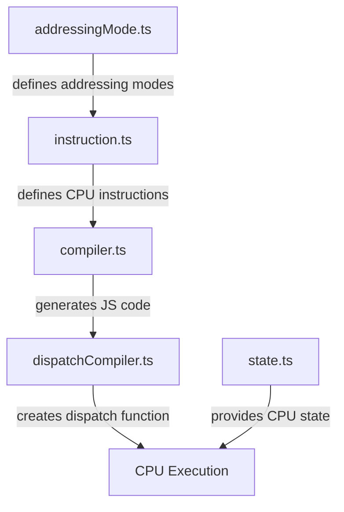

# CPU Emulation in YASNES

> **Note**: This analysis was AI generated.

## The Unholy Trinity: Instruction, Compiler, and Dispatch

The CPU emulation is built around three main components that work together in a somewhat diabolical dance:



### 1. Instruction Definitions (instruction.ts)

This file contains the dark grimoire of CPU instructions. Each instruction is defined as a class that implements the `Instruction` interface:

```typescript
export interface Instruction {
    get mnemonic(): string;
    get addressingMode(): AddressingMode;

    disassemble(mode: Mode, address: number, bus: Bus): DisassembleResult;
    compile(mode: Mode, flags: number): string;
    isImplemented(): boolean;
    description(): string;
}
```

The file defines a terrifying array of instruction classes (ADC, AND, ASL, etc.) that each:
- Specify their mnemonic (e.g., "ADC" for Add with Carry)
- Define their addressing mode (how operands are accessed)
- Implement a `build()` method that generates JavaScript code to execute the instruction

For example, the `InstructionADC` class implements the Add with Carry instruction, with different code paths for 8-bit and 16-bit operations, and even decimal mode arithmetic (a particularly nasty bit of CPU black magic).

### 2. Code Generation (compiler.ts)

The `Compiler` class is the mad scientist that transforms instruction definitions into executable JavaScript code:

```typescript
export class Compiler {
    private chunks: Array<string> = [];
    // ...
    
    add(chunk: string): Compiler {
        this.chunks.push(chunk);
        return this;
    }
    
    // Methods for different addressing modes and operations
    
    compile(): string {
        return this.chunks.join('\n');
    }
}
```

It provides methods for:
- Loading operands based on addressing modes (`loadPointer`, `load8`, `load16`)
- Storing results (`store8ToPtr`, `store16ToPtr`)
- Handling branches and flags (`branch`, `setFlagsNZ`)
- Managing the stack (`push8`, `push16`, `pull8`, `pull16`)

The compiler essentially builds up JavaScript code chunks that, when executed, will perform the CPU operation.

### 3. Dispatch Compilation (dispatchCompiler.ts)

This is where the dark ritual culminates. The `DispatchCompiler` class:

1. Generates JavaScript functions for each instruction in each CPU mode
2. Creates a dispatch function that selects the appropriate instruction handler based on the opcode and CPU mode
3. Uses `eval()` (the forbidden spell) to turn the generated code into executable functions

```typescript
public compileDispatch(): DispatchFn {
    const generator = eval(outdent`
        () => {
            ${this.generateDispatch()};

            return dispatcher;
        }
        `) as () => DispatchFn;

    return generator();
}
```

The result is a highly optimized dispatch function that can execute CPU instructions at runtime.

## The CPU State (state.ts)

The CPU state is represented by a simple object with properties for all registers and flags:

```typescript
export interface State {
    a: number; // A (accumulator)
    x: number; // X index register
    y: number; // Y index register
    pc: number; // program counter
    s: number; // stack pointer
    d: number; // direct register
    k: number; // program bank << 16
    dbr: number; // data bank << 16
    p: number; // flags
    
    slowPath: number;
    mode: Mode;
    breakReason: BreakReason;
}
```

The CPU has different modes that affect how instructions operate:
- `mx`: 16-bit accumulator, 16-bit index registers
- `mX`: 16-bit accumulator, 8-bit index registers
- `Mx`: 8-bit accumulator, 16-bit index registers
- `MX`: 8-bit accumulator, 8-bit index registers
- `em`: emulation mode (for 6502 compatibility)

## The CPU Execution (cpu.ts)

The `Cpu` class ties everything together:

```typescript
export class Cpu {
    readonly state: State = { ...INITIAL_STATE };
    
    // ...
    
    run(instructionLimit: number): number {
        return dispatch(instructionLimit, this.state, this.bus, this.clock, this.breakCb);
    }
    
    // ...
}
```

When `run()` is called, it invokes the dispatch function with:
- The maximum number of instructions to execute
- The current CPU state
- References to the bus (for memory access) and clock (for timing)
- A callback for handling breaks

## The SlowPath Mechanism: Escaping the Fast Lane

One of the most diabolical aspects of this emulator is the `slowPath` mechanism. This is a flag in the CPU state that indicates when special handling is needed, causing the emulator to break out of its optimized execution path.

The `slowPath` flag is a bitmask that can contain different reasons for taking the slow path:

```typescript
export const enum SlowPathReason {
    break = 0x01,
    modeChange = 0x02,
}
```

When an instruction sets the `slowPath` flag, the current dispatch loop is terminated:

```typescript
while (instructions < instructionLimit) {
    // Execute instruction...
    instructions++;
    if (state.slowPath) break;
}
```

This allows the main dispatcher to handle special conditions like mode changes or breaks without complicating the fast path code. It's like having an emergency exit in your high-speed execution highway - when something unusual happens, you bail out to handle it more carefully.

The main dispatcher clears specific slowPath flags before continuing execution:

```typescript
while (instructionsTotal < instructionLimit) {
    state.slowPath &= ~(SlowPathReason.break | SlowPathReason.modeChange);
    
    switch(state.mode) {
        // Dispatch based on current mode...
    }
    
    if (state.breakReason) break;
}
```

This clever design allows the emulator to maintain high performance during normal execution while still handling special cases correctly.

## Mode Switching: The Shape-Shifting CPU

The 65816 CPU can operate in different modes, affecting how instructions behave. The emulator handles this through a sophisticated mode-switching mechanism.

### Mode Representation

The CPU mode is determined by two processor flags:
- The `m` flag (bit 5): Controls whether the accumulator is 8-bit (set) or 16-bit (clear)
- The `x` flag (bit 4): Controls whether the index registers are 8-bit (set) or 16-bit (clear)

These two bits combine to form four native modes:
- `mx` (0): 16-bit accumulator, 16-bit index registers
- `mX` (1): 16-bit accumulator, 8-bit index registers
- `Mx` (2): 8-bit accumulator, 16-bit index registers
- `MX` (3): 8-bit accumulator, 8-bit index registers

Plus a fifth mode:
- `em` (4): Emulation mode (for 6502 compatibility)

### Mode Switching Instructions

Three key instructions can change the CPU mode:

1. `SEP` (Set Processor flags): Sets specified bits in the processor status register
   ```typescript
   protected build(mode: Mode, compiler: Compiler): void {
       compiler.load8(mode, this.addressingMode).add(`state.p |= op;`);
       if (mode !== Mode.em) compiler.handleFlagChange(mode);
       compiler.tick();
   }
   ```

2. `REP` (Reset Processor flags): Clears specified bits in the processor status register
   ```typescript
   protected build(mode: Mode, compiler: Compiler): void {
       compiler.load8(mode, this.addressingMode).add(`state.p &= ~op;`);
       // Handle mode changes...
   }
   ```

3. `XCE` (Exchange Carry and Emulation flags): Toggles between native and emulation modes
   ```typescript
   protected build(mode: Mode, compiler: Compiler): void {
       if (mode === Mode.em) {
           // Switch to native mode...
       } else {
           // Switch to emulation mode...
       }
   }
   ```

### The Mode Change Handler

When processor flags change, the `handleFlagChange` method updates the CPU mode:

```typescript
handleFlagChange(mode: Mode): Compiler {
    if (mode === Mode.em) {
        this.add(`state.p |= ${Flag.m | Flag.x};`);
    } else {
        this.add(outdent`
            const newMode = (state.p >>> 4) & 0x03;
            if (newMode != state.mode) {
                state.mode = newMode;

                if (state.p & ${Flag.x}) {
                    state.x &= 0xff;
                    state.y &= 0xff;
                }

                state.slowPath |= ${SlowPathReason.modeChange};
            }
        `);
    }

    return this;
}
```

This code:
1. Calculates the new mode based on the m and x flags
2. If the mode has changed, updates the CPU state
3. Truncates index registers if switching to 8-bit mode
4. Sets the `SlowPathReason.modeChange` flag to break out of the current dispatch loop

### The Dispatch Mechanism

The emulator uses different dispatch functions for each CPU mode. When a mode change occurs:

1. The instruction sets the `slowPath` flag with `SlowPathReason.modeChange`
2. The current dispatch loop terminates due to the `slowPath` flag
3. The main dispatcher clears the `modeChange` flag
4. The main dispatcher selects a new dispatch function based on the updated mode

```typescript
function dispatcher(instructionLimit, state, bus, clock, breakCb) {
    let instructionsTotal = 0;
    state.breakReason = ${BreakReason.none};

    while (instructionsTotal < instructionLimit) {
        state.slowPath &= ${~(SlowPathReason.break | SlowPathReason.modeChange)};

        switch(state.mode) {
            case 0: // mx
                instructionsTotal += dispatch_mx(instructionLimit - instructionsTotal, state, bus, clock, breakCb);
                break;
            // Other modes...
        }

        if (state.breakReason) break;
    }

    return instructionsTotal;
}
```

This approach allows the emulator to use highly optimized code paths for each CPU mode, while still handling mode transitions correctly.

## The Unholy Optimization: JIT Compilation

What makes this emulator particularly interesting (and slightly terrifying) is its use of Just-In-Time (JIT) compilation. Instead of interpreting each instruction at runtime, it:

1. Pre-generates JavaScript code for each instruction in each CPU mode
2. Compiles this code into actual JavaScript functions using `eval()`
3. Dispatches to these functions at runtime

This approach sacrifices some readability and initial startup time for blazing fast execution. It's like making a deal with the devil - your emulator runs faster, but your code becomes an eldritch horror that few mortals can comprehend.

## The Execution Flow

When the emulator runs:

1. The CPU fetches an opcode from memory using the program counter
2. The dispatch function selects the appropriate pre-compiled function based on the opcode and current CPU mode
3. The function executes, modifying the CPU state and accessing memory through the bus
4. If the instruction changes the CPU mode, it sets the `slowPath` flag
5. The dispatch loop checks for the `slowPath` flag and breaks if it's set
6. The main dispatcher handles any mode changes and continues execution with the appropriate dispatch function
7. The process repeats until an instruction limit is reached or a break occurs

## Addressing Modes

The 65816 CPU has many addressing modes (defined in `addressingMode.ts`), which determine how operands are accessed:

- Immediate: The operand is part of the instruction
- Absolute: The operand is at a specified memory address
- Direct: The operand is at an address relative to the direct register
- Indexed: The address is modified by an index register (X or Y)
- Indirect: The address points to another address
- Stack-relative: The address is relative to the stack pointer

The compiler has specific methods for handling each addressing mode, generating the appropriate code to calculate effective addresses and access memory.

## In Conclusion

This CPU emulation is a masterpiece of dark programming arts. By generating and compiling JavaScript code on the fly, it achieves high performance at the cost of code complexity. The approach is both brilliant and slightly mad - much like the best emulation projects tend to be.

The `slowPath` mechanism and mode switching system are particularly clever aspects of the design, allowing the emulator to maintain high performance during normal execution while still handling special cases correctly. It's like having multiple specialized highways for different types of traffic, with carefully designed interchanges to handle transitions between them.

Remember, when you stare too long at emulator code, the emulator stares back at you. And sometimes, it whispers secrets about the ancient hardware it mimics, secrets that were perhaps better left buried in the silicon graves of the past.